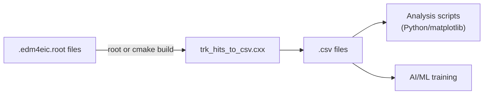

# ePIC Tracker Hits to CSV

Extract tracker hit data from ePIC simulation ROOT files (edm4eic format) into CSV for analysis and AI/ML training.


**Key files:**
- **`trk_hits_to_csv.cxx`** - C++ converter: reads `.edm4eic.root` → writes `.csv` (run as ROOT macro or build with CMake)
- **`background_analysis.py`** - Python plotting script: reads CSV → produces hit scatter plots
- **`Snakefile`** - Snakemake workflow: batch-processes many ROOT files on a cluster
- **`run_jlab_slurm.sh`** - SLURM submission helper for JLab
- **`CMakeLists.txt`** - CMake build for the C++ executable
- **`pyproject.toml`** - Python deps (snakemake, pandas, matplotlib), managed with `uv`

## Pipeline Overview



## Why edm4eic/edm4hep C++ and CSV?

We use **edm4eic** and **edm4hep** C++ libraries to read ePIC simulation data because they provide
convenient navigation between linked objects (hits -> particles -> vertices, etc.) through PODIO relations.

We store the extracted data as **CSV** because:

1. **Easy to produce in C++** - just format and write lines, no extra dependencies
2. **Easy to plot with Python** - `pandas.read_csv()` + matplotlib (especially convenient with LLMs generating plot code)
3. **Easy to use in AI/ML** - CSV loads directly into numpy, pandas, PyTorch datasets, etc.
4. **Easy for students** - no special libraries needed to inspect or work with the data

## Running the C++ Converter

`trk_hits_to_csv.cxx` can be used in two ways:

### Option 1: ROOT macro (no build step)

```bash
root -x -l -b -q 'trk_hits_to_csv.cxx("input.edm4eic.root", "output.csv")'

# Limit number of events:
root -x -l -b -q 'trk_hits_to_csv.cxx("input.edm4eic.root", "output.csv", 100)'
```

This is what Snakemake uses. Requires ROOT + edm4eic/edm4hep libraries available (e.g. inside the eic_xl container).

### Option 2: CMake build (convenient for IDEs and development)

```bash
# Inside the eic_xl container or environment with all dependencies:
mkdir build && cd build
cmake ..
make

# Run:
./trk_hits_to_csv -n 100 -o output.csv input.edm4eic.root
```

Building with CMake gives you IDE integration (code completion, debugging, etc.), which is helpful during development.

## Setup

We use [uv](https://docs.astral.sh/uv/) for Python dependency management:

```bash
uv sync
```

This installs snakemake, pandas, matplotlib, and other dependencies.

## Configuring Output Paths

The **Snakefile** reads output paths from environment variables. Before running, set:

```bash
export OUT_BASE="/volatile/eic/$USER/25.10.4_bkg-1signal-2us-frame_dis-nc_10x100_minq2-1"
```

If `OUT_BASE` is not set, snakemake will error with a helpful message.

## Running Locally

Dry-run (shows what would run):

```bash
uv run snakemake -n
```

Run with 8 cores inside the container:

```bash
uv run snakemake --cores 8 \
  --use-singularity \
  --singularity-args "--bind /volatile:/volatile --bind /cvmfs:/cvmfs"
```

## Running on SLURM (JLab)

Use the provided script:

```bash
./run_jlab_slurm.sh /volatile/eic/$USER/25.10.4_bkg-1signal-2us-frame_dis-nc_10x100_minq2-1
```

This submits snakemake jobs to the SLURM production partition with up to 2000 concurrent jobs.

Alternatively, run manually:

```bash
OUT_BASE="/volatile/eic/$USER/25.10.4_bkg-1signal-2us-frame_dis-nc_10x100_minq2-1"
LOGS="${OUT_BASE}/logs"
mkdir -p "$LOGS"

uv run snakemake \
  --executor cluster-generic --jobs 2000 \
  --cluster-generic-submit-cmd "sbatch \
    --account=eic \
    --partition=production \
    --cpus-per-task={threads} \
    --mem=4000 \
    --time=01:00:00 \
    --output=${LOGS}/slurm-%j.out \
    --error=${LOGS}/slurm-%j.err" \
  --use-singularity \
  --singularity-args "--bind /volatile:/volatile --bind /cvmfs:/cvmfs"
```

## Analysis

Plot tracker hits for a given event:

```bash
uv run python background_analysis.py output.csv 0 -o event_0_hits.png
```

## Prerequisites

- `uv` for Python package management
- `apptainer`/`singularity` on compute nodes
- Access to `/cvmfs` and `/volatile` (JLab farm)
- SLURM for batch mode
- Container image: `/cvmfs/singularity.opensciencegrid.org/eicweb/eic_xl:nightly`
